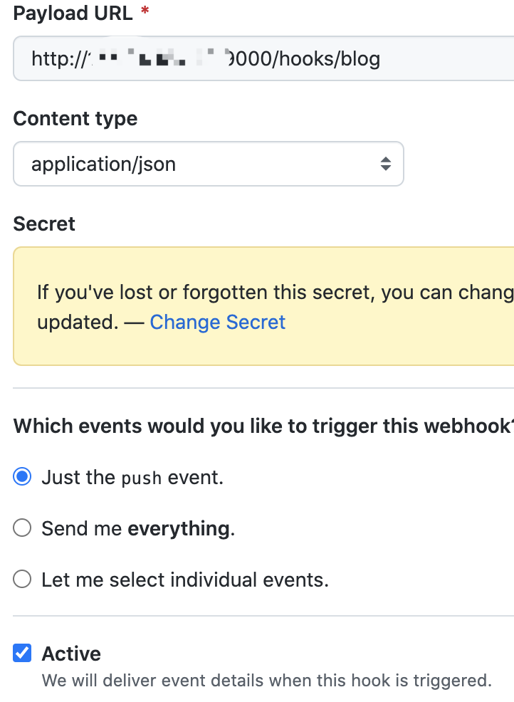

# hexo-docker

## Usage

### step 1

Set domain in nginx/hexo.conf like

```
server_name blog.b1ank.top;
```

### step 2

Clone your repository

```bash
$ git clone https://github.com/xxxxx/xxxxx.github.io
```

### step 3

```bash
$ docker-compose up -d
```

### step 4

Set your blog's repository webhook like



### step 5

Set **secret** in webhook.js

### step 6

Install webhook

```bash
$ curl -SL https://github.com/adnanh/webhook/releases/download/2.8.0/webhook-linux-amd64.tar.gz -o webhook.tar.gz \
&& tar -xf webhook.tar.gz -C /usr/local/bin/ --strip-components=1 \
&& chmod +x /usr/local/bin/webhook
```

### step 7

Start webhook

```bash
$ ./start.sh
```

## Install & renew certificate

Run in your docker :


```bash
$ certbot --nginx
```

If you are first install,  just run like

```bash
$ certbot --nginx -d "blg.b1ank.top"
```

You can renew your certificate like

```bash
$ certbot renew --quiet
```

```bash
$ echo "0 0 1 * * /usr/bin/certbot renew --quiet" >> /etc/crontabs/root
```

### reference

[Hexo部署到私人服务器解决方案](https://www.cnblogs.com/qmdx00/p/13472355.html)

[Hexo博客部署的终极解决办法](https://segmentfault.com/a/1190000040647484)

